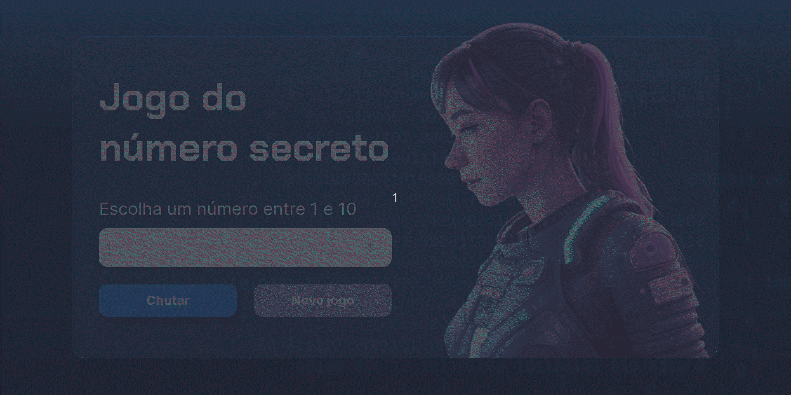

# Projeto Jogo do Número Secreto 🎮

[](https://opensource.org/licenses/MIT)

## Descrição

Este projeto foi desenvolvido com base nas vídeo aulas da Alura sobre lógica de programação com JavaScript. O Jogo do Número Secreto é uma aplicação simples em que o usuário tenta adivinhar um número secreto, proporcionando uma experiência interativa e envolvente para o aprendizado da lógica de programação com JavaScript de maneira prática e divertida.

## Como Rodar o Projeto Localmente

1. Clone o repositório.
2. Abra o arquivo `index.html` no seu navegador.

## Tecnologias Utilizadas

- HTML
- CSS
- JavaScript
- ResponsiveVoice

## Como Jogar
#### Sigam as etapas:
<ol>
    <li>Digite um número de 1 a 10, no campo de número;</li>
    <li>Clique no botão chutar;</li>
    <li>Caso não tenha acertado o número secreto repita as etapas 1 e 2</li>
    <li>caso tenha acertado clique no botão novo jogo para começar novamente.</li>
</ol>

## Demostração de como jogar



## Para usar a biblioteca javascript ResponsiveVoice, siga estes passos:

1. adicione a url https://code.responsivevoice.org/responsivevoice.js no arquivo index.html da biblioteca javascript, como mostra o exemplo abaixo:

```html
</head>
    <!-- Início do script para importar a biblioteca ResponsiveVoice -->
    <script src="https://code.responsivevoice.org/responsivevoice.js"></script>
</head>

```

2. O método responsiveVoice.speak(texto, idioma, opcoes) da biblioteca ResponsiveVoice aceita três parâmetros principais, como mostra na função abaixo:    
 -  Texto a ser falado (texto);
 -  Idioma (Português Brasil);
 -  Opções {rate: 1.2}: refere-se à taxa de fala. Quanto menor o valor mais lento fica a voz.


``` javascript 
//função para exibir a mensagem na tela inicial
function exibirNaTela(tag, texto) {
    let campo = document.querySelector( tag );
    campo.innerHTML = texto;
    
    //Síntese de voz - text-to-speech ( Acessibilidade ).
    responsiveVoice.speak( texto, 'Brazilian Portuguese Female', { rate: 1.2 });
}
```

## Licença

Este projeto é licenciado sob a Licença MIT.